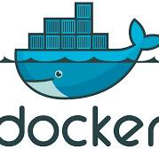

# Welcome to Frogsy!🐸
Welcome to Frogsy! An exclusive emporium dedicated to the enchanting world of amphibians! Immerse yourself in a captivating haven where aficionados of anura congregate to indulge their passion for these delightful denizens of wetlands. Our establishment serves as a premier bazaar for the procurement and exchange of frogs, where discerning enthusiasts engage in the fascinating pursuit of acquiring and parting ways with these charming creatures. Explore a kaleidoscopic array of amphibious wonders, from vibrant tree frogs to elegant bullfrogs, all meticulously curated to cater to the most refined tastes. At Frogsy, we take pride in fostering a community that cherishes the splendor of our web-footed friends. Join us on this riveting journey into the heart of the froggy realm, where every leap, croak, and hop tells a tale of biodiversity and natural splendor. Indulge your passion for all things froggy at Frogsy, your veritable sanctuary for the finest in amphibian acquisition and exchange!

## Technologies Used

## Live URL for Frogsy
https://frogsy.onrender.com/

## Screenshot

## Landing Page

On the landing page, we can see the categories nav-bar, an about us , and the main view being a gif of a lotad.

## Frogs
A Frog's card showing all details of a frog, when user in not logged in.

A Frog's card showing all details of a frog, and additional buttons when user is logged in.

## Cart
The cart when the user has not logged in.

The cart when the user is logged in, and has added a frog to the cart

## Favorites
How to favorite on Frog's page

What displays when clicking on the favorited frogs button

### Front-end

*  React
*  Redux
*  JavaScript
*  CSS
*  HTML
*  Icons
    - FontAwesome
    - GoogleFonts API

### Back-end

*  Python
*  SQL
*  SQLAlchemy
*  Alembic
*  Sqlite3 (development)
*  PostGreSQL (production)
*  Amazon Web Services (AWS)
*  Flask
*  Packages:
*  Docker

### Tools
* VS Code
* GitHub and Git
* Render for deployment and publishing

## Installation Instructions

### Back-end

* Decide on database / ORM; we used SQLAlchemy/Sqlite-developemtn; flask-sqlalchemy-alembic/PostGreSQL-production and AWS for large files (media/pictures/art)...for these instructions we'll assume you follow in our footsteps!
* Install packages needed, and dependencies on any other packages
    - pipenv -r install requirements.txt
* create a .env file with appropriate environment variable settings (see .env.example for values)
* if you use PostGreSQL, you will need to set a SCHEMA= variable to a snake_cased name for full table qualifying
* set up seed values in app/seeds
* then setup the database, migrate tables, and seed them

### Front-end

* Follow the README in react-app/
